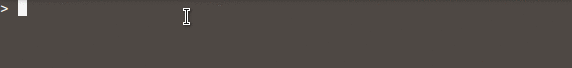

# Experimental-R

```
git clone https://github.com/dandermotj/experimental-r.git
cd experimental-r
docker build -t experimental-r .
docker run experimental-r
```

Experimental-R contains Dockerfiles for customised R builds.
Inspired by the Rocker project, Experimental-R conveniently lets 
users try out experimental R builds without having to compile R 
from source themselves.

Thanks to the work of [Lionel Henry](lionel-.github.io), the first
Experimental-R image takes the recently released R 3.4 and includes
one killer feature - a native pipe operator `|>`. No more dependencies
on magrittr's `%>%`, or confusing tracebacks when pipelines go wrong.
It's probably the most demanded feature to be implemented by R core, 
and now it's here (kind of :smirk:)!



## Why 

Around one year ago, Lionel wrote a blog post on the called 'The 
Future of R Syntax?'. In this post he discusses 4 features he 
implemented in R source:

  * a native pipe operator `|>`
  * list brackets `[1, "abc", iris]`
  * lambda notation `[x] -> x*5`
  * labelled blocks `testthat("blocks") { ... }`

I was intrigued by Lionel's work and wanted to try it out myself.
Thankfully Lionel published his work on 
[Github](https://github.com/dandermotj/r-source). So all I had to do 
was build R from source, which is not so trivial, especially when
building from a git repo (damn you SVN!).

I want users to get excited about features that we *could* have in
future R releases. Ultimately my motivation for doing this is to 
encourage R core to implement these features in R 4.0. R Core's 
conservatism has been extremely important in R's establishment and
growth. *But* these features deserve to be first class R features, 
not just package features; they've proven their usefulness 
in R and in other languages. 

## Going Further

I was hoping to merge all of Lionel's features into one branch and 
compile a version of R 3.4 with all of them, but unfortunately 
there were lots of merge conflicts in C files I had no luck resolving.
Instead I picked the feature I want the most, the pipe, and maybe in 
the future with some help we can release an image with the whole lot.

Many thanks to Lionel for his work. 
